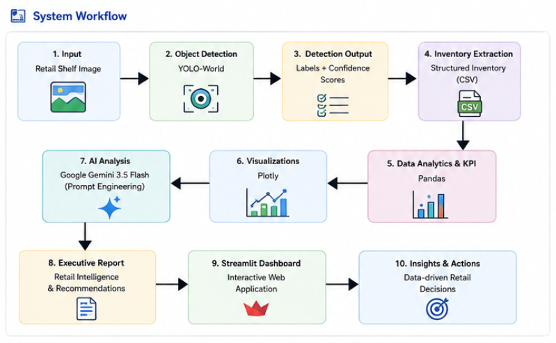

# RetailSense AI

## Intelligent Retail Shelf Analytics using Computer Vision and Generative AI

RetailSense AI is an end-to-end retail shelf analytics system that automates product detection, inventory analysis, and executive retail reporting from retail shelf images.

The project combines **Computer Vision**, **Data Analytics**, and **Generative AI** to transform retail shelf images into structured inventory reports and actionable business insights. Products are detected using **YOLO-World**, inventory analytics are performed using **Pandas** and **Plotly**, and **Google Gemini 3.5 Flash** generates executive-level retail intelligence reports and merchandising recommendations through prompt engineering.

RetailSense AI demonstrates the integration of modern AI technologies into a practical retail decision-support workflow for inventory monitoring, shelf analysis, and merchandising optimization.

---

# Key Capabilities

- Detects retail products from shelf images using YOLO-World.
- Performs automated inventory extraction and category-wise analysis.
- Calculates shelf performance KPIs including total products, product categories, and average detection confidence.
- Generates interactive inventory visualizations using Plotly.
- Produces structured inventory reports in CSV format.
- Leverages Google Gemini 3.5 Flash to generate executive retail intelligence reports.
- Provides AI-powered merchandising recommendations based on detected inventory.
- Presents inventory analytics through an interactive Streamlit dashboard.

---

# Technology Stack

## Programming Language

- Python

## Computer Vision

- YOLO-World
- OpenCV

## Data Analytics

- Pandas
- Plotly

## Generative AI

- Google Gemini 3.5 Flash
- Prompt Engineering

## Web Framework

- Streamlit

## Supporting Libraries

- NumPy
- python-dotenv

---

# System Workflow

<p align="center">
  
</p>

The RetailSense AI pipeline follows these stages:

1. Input retail shelf image.
2. Detect products using YOLO-World.
3. Extract product labels and confidence scores.
4. Generate structured inventory reports.
5. Perform inventory analytics using Pandas.
6. Visualize inventory distribution using Plotly.
7. Send structured inventory data to Google Gemini 3.5 Flash.
8. Generate executive retail intelligence reports.
9. Display analytics and AI-generated insights through the Streamlit dashboard.

---

# Project Structure

```text
AI-Retail-Shelf-Analyzer/
│
├── app/
│   └── app.py
│
├── src/
│   ├── yolo_world.py
│   └── gemini_insights.py
│
├── data/
│   └── raw/
│       └── shelf.jpg
│
├── outputs/
│   ├── images/
│   │   └── detected_shelf.jpg
│   │
│   └── reports/
│       └── inventory.csv
│
├── requirements.txt
├── README.md
└── .gitignore
```

---

# Installation

## Clone the Repository

```bash
git clone https://github.com/reddyvanessa-da-ai/AI-Retail-Shelf-Analyzer.git

cd AI-Retail-Shelf-Analyzer
```

---

## Create a Virtual Environment

### Windows

```bash
python -m venv venv

venv\Scripts\activate
```

### Linux / macOS

```bash
python3 -m venv venv

source venv/bin/activate
```

---

## Install Dependencies

```bash
pip install -r requirements.txt
```

---

## Configure Environment Variables

Create a `.env` file in the project root.

```env
GEMINI_API_KEY=YOUR_GEMINI_API_KEY
```

The `.env` file is excluded from version control through `.gitignore` to protect sensitive credentials.

---

# Running the Application

Launch the Streamlit dashboard.

```bash
streamlit run app/app.py
```

The application will automatically open in your default web browser.

---

# Dashboard Components

The interactive dashboard includes:

- Original Shelf Image
- Detected Shelf Inventory
- Inventory Table
- Shelf Performance Metrics
- Product Category Summary
- Inventory Distribution Chart
- Executive Retail Intelligence Report

---

# Executive Retail Intelligence Report

RetailSense AI integrates **Google Gemini 3.5 Flash** to transform structured inventory data into executive-level retail intelligence.

The generated report includes:

- Inventory Summary
- Shelf Distribution Analysis
- Category Performance
- Business Recommendations
- Executive Observation

The report is generated solely from the detected inventory and follows a professional retail consulting style inspired by leading consulting firms.

---

# Outputs

RetailSense AI automatically generates the following outputs.

### Detected Shelf Image

```
outputs/images/detected_shelf.jpg
```

### Inventory Report

```
outputs/reports/inventory.csv
```

### Executive Retail Intelligence Report

Generated dynamically within the Streamlit dashboard using Google Gemini 3.5 Flash.

---

# Applications

RetailSense AI can be applied to:

- Smart Retail
- Shelf Monitoring
- Inventory Management
- Merchandising Analytics
- Retail Automation
- Computer Vision Applications
- AI-assisted Retail Decision Support

---

# Future Enhancements

- Multi-shelf image analysis
- Real-time video-based inventory monitoring
- Shelf occupancy estimation
- Product stock-out detection
- OCR-based price tag recognition
- Barcode integration
- Historical inventory trend analysis
- Cloud deployment
- Database integration

---

# Author

**G Vanessa Reddy**

Computer Science Undergraduate | AI/ML | Generative AI | Data Analytics

LinkedIn:
https://www.linkedin.com/in/g-vanessa-reddy/

GitHub:
https://github.com/reddyvanessa-da-ai

Project Repository:
https://github.com/reddyvanessa-da-ai/AI-Retail-Shelf-Analyzer

---
